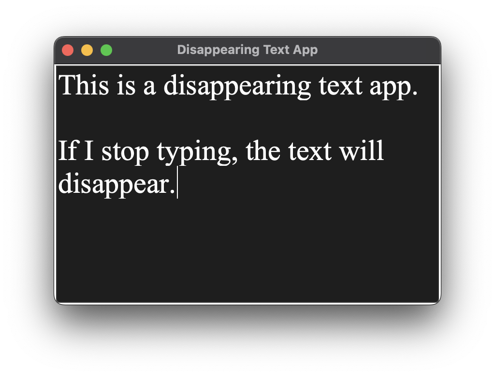

# Disappearing Text App
This code is used to build a GUI using tkinter, which allows users to type into a text box, and then automatically clears the content after one second of not typing. The title of the window is also set, as well as the geometry. It is set to monitor user input, and clears the input after 1 second of user not typing.

## Getting Started
To get started, simply download the code and run it. The code creates a text box for the user to type in, and binds an event to it to update the stoppedTyping variable. It also creates a checkIfStoppedTyping() function to check if the user has stopped typing, and if they have, it clears their input. Lastly, it starts the timer and the main loop.

## Usage
Simply type into the text box, and if the user stops typing for one second, the contents of the text box will be cleared.

##  Contributing
If you would like to contribute to this project, please feel free to do so. We are always looking for ways to improve the code and make it more efficient.

